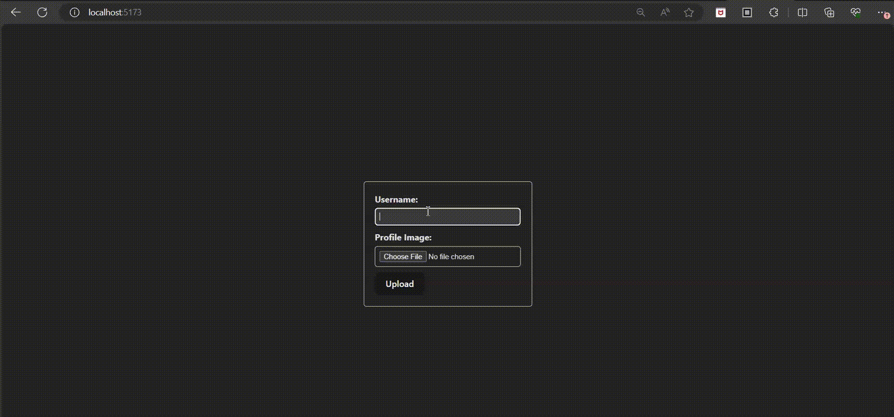

# File upload react flask demo

# Frontend

This is the frontend of our application, built using React. It provides a user interface for users to interact with the application.

## Installation

1. Clone this repository.
2. Navigate to the `frontend` directory.
3. Run `npm install` to install dependencies.
4. Run `npm start` to start the development server.

## Usage

1. Once the development server is running, open your browser and navigate to `http://localhost:3000`.
2. You should see the application running in your browser.
3. Use the provided forms and features to interact with the application.

## Additional Information

- This frontend is designed to work with the backend server running on `http://localhost:3000`. Make sure the backend server is running before using the frontend.
- Make sure to set up the backend server according to its README.md file to ensure proper functionality.

# Backend

This is the backend of our application, built using Flask. It provides API endpoints for the frontend to interact with and handles data processing and storage.

## Installation

1. Clone this repository.
2. Navigate to the `backend` directory.
3. Set up a virtual environment (optional but recommended).
4. Install dependencies by running `pip install -r requirements.txt`.
5. Set up your environment variables as described in the `.env.example` file.
6. Run the Flask server by executing `python app.py`.

## Usage

1. Once the server is running, it will be accessible at `http://localhost:5000`.
2. The server exposes various API endpoints for interacting with the application.
3. Make requests to these endpoints from the frontend or other clients to perform CRUD operations on the data.

## API Endpoints

- `/upload` (POST): Uploads a user profile with a username and profile image.

## Additional Information

- This backend server is designed to work with the frontend running on `http://localhost:3000`. Make sure the frontend server is running before using the backend.
- Make sure to set up any required databases or storage services according to the environment variables and configurations specified in the `.env.example` file.
- Ensure that CORS is configured properly if the frontend and backend are hosted on different domains.
- Feel free to extend the functionality by adding more endpoints or middleware as needed.
